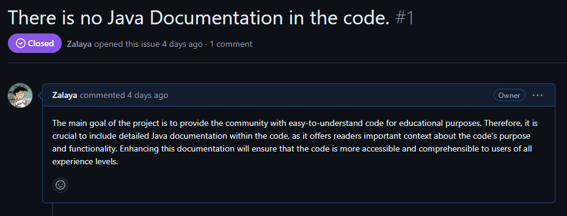
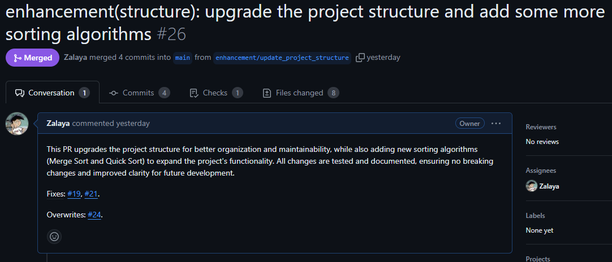

# Contributing to the Project

Thank you for considering contributing to our project! To maintain a high-quality and organized codebase, please follow these guidelines for committing changes and creating pull requests.

## Table of Contents

- [Commit Messages](#commit-messages)
    - [Commit Message Format](#commit-message-format)
    - [Commit Types](#commit-types)
    - [Examples](#examples)
- [Labels](#labels)
    - [Labels Overview](#labels-overview)
    - [Labels Table](#labels-table)
- [Issues](#issues)
    - [Examples](#examples-1)
- [Pull Requests](#pull-requests)
    - [Examples](#examples-2)

## Commit Messages

To keep the project history clear and useful, commit messages must follow the conventional commit format, there are a few rules to follow besides the format itself:

- **Lowercase only:** Keep the entire commit message in lowercase (No capital letters).
- **No period:** Do not end the commit message with a period.
- **No body or footer:** Do not include a body or footer in the commit message.
- **Imperative mood:** Write commit messages in the imperative mood (E.g., "add feature" instead of "added feature").
- **Short and clear:** Keep commit messages short and to the point.

### Commit Message Format

Each commit message should adhere to the following format:

```
<type>(<scope>): <description>
```

- **type**: The type of change being made.
- **scope**: The area of the codebase affected by the change. (Scope is optional but recommended for clarity.)
- **description**: A short, imperative description of the change.

### Commit Types

Use one of the following types to categorize your commit:

| Type         | Description                                                              |
|--------------|--------------------------------------------------------------------------|
| **feat**     | A new feature or enhancement.                                            |
| **fix**      | A bug fix.                                                               |
| **docs**     | Documentation-only changes (e.g., markdown, comments).                   |
| **style**    | Formatting and code style changes (no functional impact).                |
| **refactor** | Code changes that neither fix a bug nor add a feature (e.g., cleanup).   |
| **test**     | Adding or updating tests.                                                |
| **build**    | Changes to the build process or dependencies.                            |
| **ci**       | Changes to CI configuration files or scripts.                            |
| **chore**    | Miscellaneous tasks that do not fit into the other categories.           |

### Examples

- **feat(bubble): add new bubble sorting algorithm with descriptive method names**
- **refactor(algorithms): reorganize sorting algorithms for better clarity**
- **docs(readme): update readme with new setup instructions**
- **fix(bubble): fix edge case in bubble sort algorithm**
- **test(bubble): add test cases for bubble sort algorithm**
- **style(bubble): format bubble sort algorithm code**
- **build(dependencies): update dependencies to latest versions**

## Labels

Labels help to categorize issues and pull requests, making it easier to manage and track them. Here are the available labels and their descriptions:

### Labels Overview

- **Bug**: Indicates that the issue or pull request addresses a bug in the codebase.
- **Difficulty**: Categorizes the issue by the level of difficulty (Easy, Medium, Hard).
- **Documentation**: Relates to changes or updates in documentation.
- **Enhancement**: Refers to improvements or upgrades to existing features.
- **Feature**: Denotes the addition of a new feature.
- **Priority**: Indicates the importance of the issue (High, Medium, Low).
- **Status**: Shows the current status of the issue or pull request (To do, In progress, Paused, Done).

### Labels Table

| Label                   | Description                                                                     |
|-------------------------|---------------------------------------------------------------------------------|
| **Bug**                 | Identifies issues that involve bugs or defects in the codebase.                 |
| **Enhancement**         | Represents requests for improvements or enhancements to existing features.      |
| **Feature**             | Indicates the addition of a new functionality or feature to the project.        |
| **Documentation**       | Refers to tasks related to creating or updating project documentation.          |
| **Difficulty: Easy**    | Indicates that the issue is relatively simple and suitable for beginners.       |
| **Difficulty: Medium**  | Suggests that the issue requires a moderate level of effort and experience.     |
| **Difficulty: Hard**    | Marks issues that are complex and require advanced knowledge or skills.         |
| **Priority: High**      | Highlights issues or pull requests that require immediate attention.            |
| **Priority: Medium**    | Suggests that the issue or pull request is important but not urgent.            |
| **Priority: Low**       | Indicates that the issue or pull request has lower urgency.                     |
| **Status: Done**        | Shows that the issue or pull request has been completed.                        |
| **Status: Paused**      | Marks the issue or pull request as temporarily on hold.                         |
| **Status: In progress** | Indicates that work on the issue or pull request is currently underway.         |
| **Status: To do**       | Denotes that the issue or pull request is pending and has not been started yet. |

## Issues

An issue should be created for each task, bug, or feature that needs to be addressed. When creating an issue, please provide a clear and detailed description of the problem or task, along with any relevant information or context. Make sure to assign the appropriate labels to the issue to help categorize and prioritize it.

### Examples



## Pull Requests

Pull requests should be created for each task or feature that is being worked on. When creating a pull request, please provide a clear and concise description of the changes made, along with any relevant information or context. Make sure to reference the issue that the pull request addresses and assign the appropriate labels to the pull request.

### Examples



Following these guidelines will help maintain a structured and effective workflow for contributing to the project. Thank you for your contributions!
